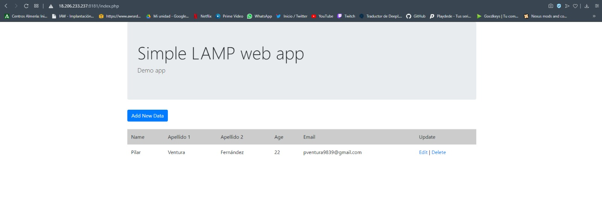

# PROYECTO FINAL PHP

Este proyecto consiste en añadir apellido 1 y apellido 2 en nuestra pequeña tabla. Para ello hemos tenido que configurar los siguientes archivos: 

- add.php
- edit.php
- index.php
- add.html

Además de añadir dentro de la base de datos apellido 1 y 2. (database.sql)

